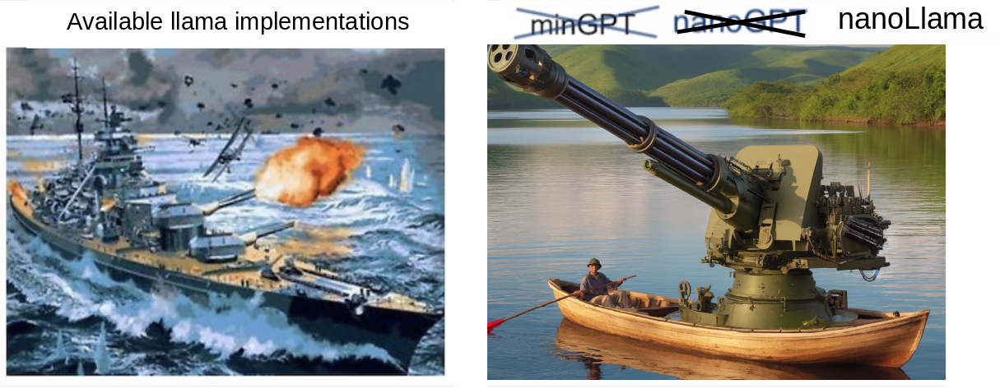

# nanoLlama2



The simplest, fastest repository for training/finetuning medium-sized llama-2. It is a rewrite of [nanoGPT](https://github.com/karpathy/nanoGPT) that prioritizes teeth over education. Still under active development, but currently the file `train.py` reproduces llama-2 (124M) on OpenWebText

this is still WIP with a few things planned, hopefully some docs, FSDP support, SFT+(PPO/DPO) support. There are a lot of existing repos that are better for training and finetuning LLMs from scratch however I still found myself coming back to [nanoGPT](https://github.com/karpathy/nanoGPT) but GPT-2 architecture is a little dated by now so wanted to make nanoGPT but using llama2 architecture. This repos primary intent is to be for educational purposes and not necessarily production ready code.
## install

```
python3 -m pip install torch numpy transformers datasets tiktoken wandb tqdm sentencepiece
```


## quick start

If you are not a deep learning professional and you just want to feel the magic and get your feet wet, the fastest way to get started is to train a character-level GPT on the works of Shakespeare. First, we download it as a single (1MB) file and turn it from raw text into one large stream of integers:

```
$ python3 data/shakespeare_char/prepare.py
```

This creates a `train.bin` and `val.bin` in that data directory. Now it is time to train your GPT. The size of it very much depends on the computational resources of your system:

**I have a GPU**. Great, we can quickly train a baby GPT with the settings provided in the [config/train_shakespeare_char.py](config/train_shakespeare_char.py) config file:

```
$ python3 train.py config/train_shakespeare_char.py
```


## reproducing llama-2

A more serious deep learning professional may be more interested in reproducing llama-2 results. So here we go - we first tokenize the dataset, in this case the [OpenWebText](https://openwebtext2.readthedocs.io/en/latest/), an open reproduction of OpenAI's (private) WebText:

```
$ python3 data/openwebtext/prepare.py
```
or feel free to use curl to fix this
```
$ curl https://storage.googleapis.com/compiled-blob/train.bin > ./data/openwebtext/train.bin
$ curl https://storage.googleapis.com/compiled-blob/val.bin > ./data/openwebtext/val.bin
```


This downloads and tokenizes the [OpenWebText](https://huggingface.co/datasets/openwebtext) dataset. It will create a `train.bin` and `val.bin` which holds the GPT2 BPE token ids in one sequence, stored as raw uint16 bytes. Then we're ready to kick off training. To reproduce llama-2 (124M) you'll want at least an 8X A100 40GB node and run:

```
$ torchrun --standalone --nproc_per_node=8 train.py config/train_medllama.py
```
